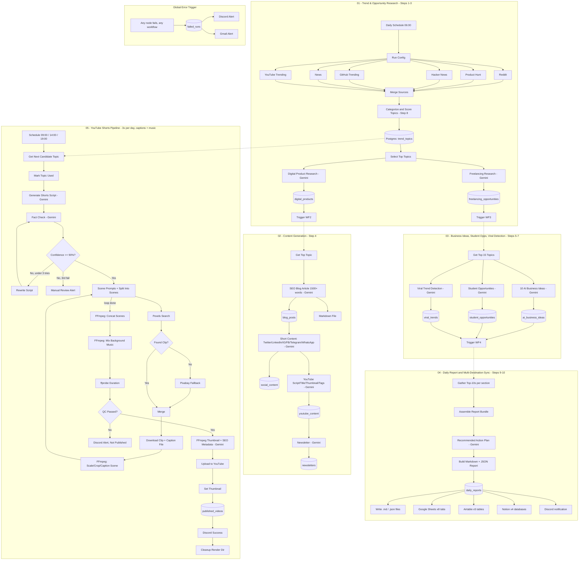

# AI Content Automation — n8n Daily Trend, Product & Content Pipeline

> **Two implementations of the same pipeline live in this repo.** This file
> documents the n8n version (self-hosted, visual editor). For the GitHub
> Actions version (no server, runs as scheduled Python on GitHub's own
> infrastructure), see **[README-GITHUB-ACTIONS.md](README-GITHUB-ACTIONS.md)**.
> Pick one — you don't need both running at once.

A self-hosted n8n system that implements the full "Master Prompt for n8n AI Content
Automation" — and runs at **$0 ongoing cost** (aside from whatever you already pay to
host a small VM). It researches trending opportunities every day across 21 categories
(freelancing, digital products, AI tools, SaaS, side hustles, and more), turns the
best ones into a full content package (SEO blog, short-form social posts, YouTube
script, newsletter), generates 10 fresh AI business ideas, finds student-friendly
opportunities, detects viral trends, scores everything on 8 dimensions, and produces
a daily report that's synced to Postgres, Google Sheets, Airtable, Notion, and
Markdown/JSON files. A fifth workflow turns the same daily trend pool into **3
caption-only YouTube Shorts published to your channel every day**, with fact-checking,
stock footage, self-hosted rendering, thumbnail, SEO metadata, and automated QC
before publish.

Every LLM call runs against **Gemini** via a free Google AI Studio API key (no
OpenAI, no self-hosted model to run). Every video is assembled from **free stock
footage** (Pexels, with Pixabay as a second free source) using **self-hosted
FFmpeg** — no Runway/Kling/Veo, no Shotstack, no Bannerbear, no ElevenLabs. The
trade-off: Shorts are **caption-only** (on-screen text + royalty-free music, no AI
voiceover) — see section 9a for why, and how to add narration back in if you want
it later.

Import order: `workflows/error-handler-workflow.json` →
`workflows/01-trend-research-workflow.json` → `workflows/02-content-generation-workflow.json`
→ `workflows/03-business-student-viral-workflow.json` → `workflows/04-daily-report-workflow.json`
→ `workflows/05-youtube-shorts-pipeline.json`.
Set every workflow's `settings.errorWorkflow` to the imported Error Handler's real
workflow ID after import (the placeholder `error-handler-workflow-id` in each JSON
file must be replaced).

---

## 1. Architecture Diagram



---

## 2. Node-by-Node Explanation

### Workflow 01 — Trend & Opportunity Research (Steps 1–3)

| Node | Purpose |
|---|---|
| **Daily Schedule Trigger (06:00)** | Cron `0 6 * * *` — one full research + content run per day |
| **Run Config** | Generates `run_id`/`run_date` used to tie every downstream row together |
| **Fetch Reddit / Product Hunt / Hacker News / GitHub Trending / News / YouTube Trending** | 6 parallel HTTP calls, each with `continueOnFail` + retry so one dead source doesn't kill the run. (Google Trends/SerpAPI was intentionally dropped — it's a paid API with no free key-based equivalent; these 6 free sources already cover trend discovery.) |
| **Merge All Sources** | Appends all 6 branches into one flat item list |
| **Categorize & Score Topics** | Code node: maps each raw item into one of the 21 opportunity categories via keyword heuristics, tags a recency window (24h/7d/30d), dedupes, and computes all 8 STEP-8 scores (demand, profitability, difficulty, competition, SEO, viral, automation, long-term) |
| **Save Trend Topics (Postgres)** | Persists the full scored candidate pool |
| **Select Top Topics** | Keeps the top 2 topics per category (≤20 total) as research seeds |
| **Digital Product Research (Gemini)** | STEP 2 — returns ≥10 digital products with all required fields + scores |
| **Freelancing Research (Gemini)** | STEP 3 — returns ≥10 freelancing opportunities with all required fields + scores |
| **Parse + Save nodes** | Validate/flatten each AI response, insert one row per idea |
| **Trigger Content Generation / Trigger Business-Student-Viral** | `Execute Workflow` nodes hand off to workflows 02 and 03 |

### Workflow 02 — Content Generation (Step 4)

| Node | Purpose |
|---|---|
| **Get Top Topic (Postgres)** | Pulls the single highest-scoring candidate topic |
| **Generate SEO Blog Article (Gemini)** | Enforces JSON schema: title, meta description, SEO keywords, intro, main content (markdown, H2/H3), conclusion, ≥5 FAQs; system prompt requires ≥1500 words total |
| **Parse & Validate Blog** | Computes actual word count and carries it forward for auditing |
| **Build Blog Markdown / Write Blog Markdown File** | Renders the blog as a `.md` file under `output/blogs/` |
| **Generate Short Content (Gemini)** | One call returning Twitter thread, LinkedIn post, Instagram caption, Facebook post, Telegram post, WhatsApp broadcast |
| **Generate YouTube Content (Gemini)** | Video title, thumbnail idea, full script, description, tags, hashtags |
| **Generate Newsletter (Gemini)** | Weekly trends, market insights, opportunities, actionable tips, recommended tools, business ideas |
| Each generator has a matching **Parse** + **Save (Postgres)** pair | One table per content type (`blog_posts`, `social_content`, `youtube_content`, `newsletters`) |

### Workflow 03 — AI Business Ideas, Student Opportunities & Viral Detection (Steps 5–7)

| Node | Purpose |
|---|---|
| **Get Top 15 Topics** | Broader context window than WF2's single topic, since these calls need category diversity |
| **Generate 10 AI Business Ideas (Gemini)** | STEP 5 — problem, solution, target users, revenue model, dev cost, market size, monthly revenue potential, MVP features, AI features, monetization strategy + 4 scores |
| **Parse & Validate 10 Ideas** | Throws (→ Error Handler) if the model returns fewer than 10 ideas |
| **Generate Student Opportunities (Gemini)** | STEP 6 — online earning, internships, digital products, AI tools, freelancing, remote jobs, each with skill level/income/time/platforms/resources |
| **Detect Viral Trends (Gemini)** | STEP 7 — virality score, growth potential, competition score, revenue potential, plus the full STEP 8 scoring set |
| **Merge Completion → Trigger Daily Report & Sync** | Waits for all three branches, then hands off to workflow 04 |

### Workflow 04 — Daily Report & Multi-Destination Sync (Steps 9–10)

| Node | Purpose |
|---|---|
| **13 parallel Postgres SELECTs** | Top 10 opportunities/products/freelancing niches/AI tools/startup ideas/trending topics/side hustles, highest-revenue idea, lowest-competition opportunity, and the latest blog/social/YouTube/newsletter rows |
| **Merge All Report Data → Assemble Report Bundle** | Regroups the 13 branches back into named fields (Merge flattens; the Code node re-attributes by source node name) |
| **Generate Recommended Action Plan (Gemini)** | STEP 9 §10 — today/this-week/this-month guidance based on the highest-demand + lowest-competition + highest-revenue items |
| **Build Daily Report** | Renders the full 10-section Markdown report and keeps the structured JSON alongside it |
| **Save Daily Report (Postgres)** | System of record for the report |
| **Write Markdown / JSON files** | STEP 10 file outputs |
| **Sync to Google Sheets (×8 tabs)** | Trends, Digital Products, Freelancing, AI Business Ideas, Blogs, Social Media Posts, Newsletters, Daily Reports — one tab per output category, each branching directly off its source Postgres query so it gets real per-row data (not the aggregated bundle) |
| **Sync to Airtable (×5 tables)** | Trends, Digital Products, Freelancing, AI Business Ideas, Daily Reports |
| **Sync to Notion (×4 databases)** | Trends, Products, Content, Reports databases (configure the 4 database IDs in `.env`) |
| **Notify Report Ready (Discord)** | Posts the day's headline numbers |

### Workflow 05 — YouTube Shorts Pipeline (3×/day, $0 stack)

| Node | Purpose |
|---|---|
| **Shorts Schedule Trigger (3x/day)** | Cron `0 9,14,19 * * *` — 3 firings/day, each publishing 1 Short |
| **Get Next Candidate Topic / Mark Topic Used** | Pulls the highest-scoring `trend_topics` row still `candidate`, flips it to `used` so each of the 3 daily firings gets a different topic |
| **Generate Shorts Script (Gemini)** | 6–10 short punchy sentences written for **reading**, not listening (each sentence becomes one on-screen caption card) |
| **Fact Check → Confidence >= 90%?** | Independent Gemini verification pass; below threshold routes to **Rewrite Script**, looped back into fact-check, capped at 3 attempts by `_rewrite_count`, then to a Discord "needs manual review" alert |
| **Generate Scene Prompts** | Splits the script into one item **per sentence** (this matters — see the note below), each carrying a short Pexels search query derived from the sentence's keywords and a fixed 4s duration |
| **Split Into Scenes** | Loops one scene at a time (`splitInBatches`, batch size 1) |
| **Search Pexels Stock Footage → Pexels Found Clip? → Search Pixabay Stock Footage (fallback)** | Pexels is the primary free video source; Pixabay is a second free source if Pexels comes up empty for that query |
| **Download Scene Clip → Build Scene Files → Write Scene Clip/Caption to Disk** | Downloads the chosen clip, writes it plus a caption `.txt` file (used by FFmpeg's `drawtext=textfile=...` so the caption text never has to be shell-escaped) to the shared render volume |
| **Build FFmpeg Process Command → Process Scene (FFmpeg)** | Scales/crops to 1080×1920, trims to 4s, burns in the caption, strips the clip's own audio |
| **Loop Back (Next Scene)** | Returns to Split Into Scenes until every sentence has a processed clip |
| **Build Concat List → Concatenate Scenes (FFmpeg)** | Fires once after the loop; joins all processed scene clips into one video with `ffmpeg -f concat` |
| **Download Background Music → Write Music to Disk → Build Mix Command → Mix Background Music (FFmpeg)** | Loops/mixes a royalty-free track (`BG_MUSIC_URL`) at low volume under the video |
| **Build Probe Command → Get Video Duration (ffprobe) → Automated Quality Check** | Reads the real rendered duration and checks it's in a sane Shorts range |
| **QC Passed?** | Failing QC alerts Discord, cleans up, and stops — never uploads a broken render |
| **Build Title Caption → Write Title File → Build Thumbnail Command → Extract Thumbnail (FFmpeg)** | Grabs a frame from the final video and burns the title on top as the thumbnail |
| **Generate SEO Metadata (Gemini)** | Runs in parallel with the thumbnail extraction, merged before upload |
| **Read Final Video File / Read Thumbnail File** | Loads the rendered files back into n8n as binary data for the YouTube nodes |
| **Upload to YouTube → Set YouTube Thumbnail → Log Published Video (Postgres) → Cleanup Render Directory → Notify Success (Discord)** | Uploads `private` with `publishAt` ~1h out, attaches the thumbnail, logs to `published_videos`, deletes the run's temp files, posts the live link |

> **Why "Generate Scene Prompts" returns one item per scene, not one item with a
> `scenes` array**: n8n's `splitInBatches` loop node batches over its *input items*,
> not over a nested array field. A single item containing `{scenes: [...]}` would
> make the loop fire exactly once regardless of how many scenes are in that array —
> it would never actually iterate per-scene. This was a real bug I caught and fixed
> while building this workflow (it would have silently processed only the first
> scene, or none, every single run). Every "one item per unit of work" node in this
> pipeline follows the same rule.

**Error handler workflow** (wired as the global `errorWorkflow` for all five
pipelines): catches any node failure anywhere in the system, logs it to
`failed_runs`, and alerts both Discord and Gmail with the failed workflow/node/message.

---

## 3. Required Services — everything here is free

| Function | Service | Cost |
|---|---|---|
| Reddit / Product Hunt / GitHub / Hacker News / News trends | Reddit API, Product Hunt GraphQL API, GitHub REST API, HN Algolia API, NewsAPI.org | Free (NewsAPI free tier: 100 req/day; others free/no key) |
| YouTube trending + upload | YouTube Data API v3 | Free, quota-limited (10k units/day; an upload costs ~1,600 units) |
| All content generation (research, blog, social, business ideas, Shorts scripts, fact-check, SEO) | Gemini API (`gemini-2.0-flash` by default) via a free Google AI Studio key | Free tier — no self-hosting, no per-call charge at this usage volume |
| Database | Self-hosted Postgres (via `docker-compose.yml`) | Free |
| Secondary storage | Google Sheets, Airtable (free tier: 1,000 records/base), Notion | Free tiers |
| Alerts | Discord webhook, Gmail | Free |
| Shorts video source | Pexels + Pixabay stock video APIs | Free |
| Shorts video rendering + thumbnail | Self-hosted FFmpeg (built into the n8n container) | Free |
| Shorts audio | A royalty-free track you host somewhere (YouTube Audio Library / Pixabay Music / freesound.org) | Free |

Nothing in this stack requires a credit card except, potentially, the YouTube OAuth
setup itself (Google Cloud Console account — free, no billing required for this
usage level) and whatever you're already paying to host the VM.

---

## 4. Credentials to Configure in n8n

Create these under **Settings → Credentials**:

1. `Reddit OAuth2` — client ID/secret, script-type app
2. `Postgres account` — host/user/password (matches `docker/.env`)
3. `Google Sheets account` (OAuth2)
4. `Airtable account` (Personal Access Token)
5. `Notion account` (internal integration token, shared with the 4 target databases)
6. `Discord Webhook` — per-workflow webhook URL
7. `Gmail account` (OAuth2) — for failure emails
8. `YouTube OAuth2` — Google Cloud OAuth client with `youtube.upload`, `youtube.readonly`
   scopes, consented by the channel's owning Google account (walkthrough: section 9)

**Gemini needs no n8n credential object either** — every LLM call is a plain HTTP
Request node with the API key passed as a `key` query parameter read from
`GEMINI_API_KEY`. HTTP Request nodes calling Product Hunt, Hacker News, GitHub,
NewsAPI, Pexels, and Pixabay use the same pattern (header/query auth pulled from
environment variables, see `docker/.env.example`) rather than n8n credential
objects, since these are simple API-key/token services — convert any of them to a
**Generic Header Auth** credential if you prefer not to store keys in `.env`.

---

## 5. Environment Variables

See `docker/.env.example` for the full list, grouped by pipeline stage. Copy it to
`.env` and fill in real values before starting the stack:

```bash
cp docker/.env.example docker/.env
```

---

## 6. Folder Structure

```
.
├── workflows/
│   ├── error-handler-workflow.json              # global error catcher (import first)
│   ├── 01-trend-research-workflow.json           # Steps 1-3
│   ├── 02-content-generation-workflow.json       # Step 4
│   ├── 03-business-student-viral-workflow.json   # Steps 5-7
│   ├── 04-daily-report-workflow.json             # Steps 9-10
│   └── 05-youtube-shorts-pipeline.json           # 3 Shorts/day, $0 stack
├── db/
│   └── schema.sql                                 # Postgres/Supabase schema
├── docker/
│   ├── docker-compose.yml                         # Postgres + n8n (built w/ FFmpeg)
│   ├── Dockerfile.n8n                             # n8n image + ffmpeg + fonts
│   └── .env.example
└── README.md                                      # this file
```

---

## 7. Error Handling & Retry Logic

- **Per-node retries**: every external API call (`httpRequest`, `postgres`,
  `executeCommand`) has `retryOnFail: true` with 2–3 attempts and backoff (2–5s).
- **continueOnFail** on trend-source HTTP calls, stock-footage searches, and
  secondary-storage sync nodes (Sheets/Airtable/Notion) means one dead source
  degrades that one thing instead of halting the run — Postgres remains the system
  of record regardless.
- **Idea-count guard**: `Parse & Validate 10 Ideas` throws if the model returns fewer
  than 10 AI business ideas, routing the run to the Error Handler instead of silently
  under-delivering STEP 5's daily quota.
- **Blog word-count tracking**: `Parse & Validate Blog` computes the real word count
  so short outputs are visible in Postgres/reports even though they aren't hard-blocked
  (tighten this into an IF-gated regenerate loop if you need a hard 1500-word floor).
- **Global Error Trigger**: every workflow's `settings.errorWorkflow` points at
  `error-handler-workflow.json`, which logs to `failed_runs` and pages Discord + Gmail
  for anything not already caught locally.
- **Shorts fact-check loop**: capped at 3 rewrite attempts (`_rewrite_count`), then
  routes to a Discord "needs manual review" alert instead of publishing an
  unverified script or looping forever.
- **Shorts stock-footage fallback**: Pexels is tried first; if a scene's search comes
  up empty, Pixabay is tried before that scene fails outright.
- **Shorts QC gate**: failed quality checks (duration outside a sane Shorts range,
  read from the actual rendered file via `ffprobe`, not assumed) never reach the
  YouTube upload step — they route to a Discord alert and a cleanup step instead.
- **Render directory cleanup**: every run (success or QC failure) deletes its own
  `RENDER_DIR/<run_id>` folder at the end, so downloaded clips/audio/intermediate
  files don't accumulate on disk across 3 runs/day indefinitely. The cleanup command
  refuses to run if the computed path looks unsafe (empty, `/`, or suspiciously
  short) rather than silently doing nothing or, worse, deleting the wrong thing.

---

## 8. Deployment Guide (Self-Hosted, Docker)

1. **Provision a VM** (2 vCPU / 4GB RAM is enough — Gemini runs in the cloud, so
   this box only needs to handle n8n, Postgres, and FFmpeg encoding, not an LLM).
2. **Install Docker & Docker Compose.**
3. Clone/copy this project folder to the server.
4. `cd docker && cp .env.example .env` and fill in all credentials/keys, including
   `GEMINI_API_KEY` from [aistudio.google.com/apikey](https://aistudio.google.com/apikey)
   (free, sign in with the Google account you want billed if you ever exceed the
   free tier — no card required to generate the key itself).
5. `docker compose up -d` — builds the n8n image (with FFmpeg baked in) and starts
   Postgres + n8n. The first build takes a few minutes.
6. Open `http://<server-ip>:5678`, log in with your basic-auth credentials.
7. **Import workflows** in this order: Error Handler → 01 Trend Research → 02 Content
   Generation → 03 Business/Student/Viral → 04 Daily Report → 05 YouTube Shorts
   (`Workflows → Import from File`, pick each JSON from `workflows/`).
8. Set every workflow's error workflow to the imported Error Handler
   (`Workflow Settings → Error Workflow`) — this replaces the placeholder
   `error-handler-workflow-id` string baked into each JSON file.
9. Update the three `Execute Workflow` nodes (in WF01 → WF02/WF03, and WF03 → WF04)
   to point at the actual imported workflow IDs — n8n reassigns IDs on import.
   Workflow 05 doesn't need this: it reads directly from `trend_topics` on its own
   schedule rather than being triggered by another workflow.
10. Configure the 8 credential types listed in section 4 (including `YouTube OAuth2`
    — see section 9 if you haven't set this up before), and the 4 Notion database
    IDs / Google Sheet ID / Airtable base ID / `YT_CHANNEL_ID` / `PEXELS_API_KEY` /
    `BG_MUSIC_URL` in `.env`.
11. Run workflow 01 once manually to verify each branch before activating the
    schedule trigger; then run workflow 05 once manually against a leftover
    `candidate` topic to verify the full render → upload chain before activating
    its schedule. **This is the step to not skip** — see section 9a for why the
    FFmpeg pipeline specifically deserves a watched first run.
12. Put a reverse proxy (Caddy/Nginx) with TLS in front of port 5678 for anything
    beyond local testing — see security notes below.

---

## 9. YouTube OAuth2 Setup (Google Cloud Console)

Workflow 05 uploads real videos to your channel, which requires a Google Cloud
OAuth client — there's no API-key shortcut for this, and it's free. Walkthrough:

1. **Create/select a Google Cloud project**: [console.cloud.google.com](https://console.cloud.google.com) →
   create a new project (or reuse one) dedicated to this automation.
2. **Enable the YouTube Data API v3**: in the project, go to
   *APIs & Services → Library*, search "YouTube Data API v3", click **Enable**.
3. **Configure the OAuth consent screen**: *APIs & Services → OAuth consent screen*.
   - User type: **External** (unless you have a Google Workspace org, then Internal
     is simpler).
   - Fill in app name, support email, developer contact.
   - Scopes: add `.../auth/youtube.upload` and `.../auth/youtube.readonly`.
   - Test users: add the Google account that owns the target YouTube channel (while
     the app is in "Testing" mode, only listed test users can authorize it).
4. **Create OAuth client credentials**: *APIs & Services → Credentials → Create
   Credentials → OAuth client ID*.
   - Application type: **Web application**.
   - Authorized redirect URI: `https://<your-n8n-host>/rest/oauth2-credential/callback`
     (n8n shows you this exact URL when you create the credential in the next step —
     copy it from there to avoid typos).
   - Save the generated **Client ID** and **Client Secret**.
5. **Create the credential in n8n**: *Settings → Credentials → New → YouTube OAuth2
   API*. Paste the Client ID/Secret, click **Connect my account**, and sign in with
   the Google account that owns the channel — approve the consent screen.
6. **Publishing status**: while the OAuth consent screen is in "Testing" mode, tokens
   expire every 7 days and only test users can connect. For a long-running unattended
   pipeline, submit the app for **verification** (Google reviews the requested
   scopes) so tokens don't expire — required if `youtube.upload` is requested and you
   want this to run for months without re-authenticating.
7. **Find your channel ID** for `YT_CHANNEL_ID` in `.env`: YouTube Studio →
   Settings → Channel → Advanced settings, or `https://www.youtube.com/account_advanced`.

### 9a. Gemini setup, rate limits, and FFmpeg confidence notes

**Getting a Gemini API key**: go to [aistudio.google.com/apikey](https://aistudio.google.com/apikey),
sign in with a Google account, click **Create API key**. No separate billing
project is required to get a free-tier key — it's a different, much shorter flow
than the YouTube OAuth setup above. Put it in `GEMINI_API_KEY` in `.env`.

**Rate limits**: Google AI Studio's free tier is request-per-minute and
request-per-day limited (the exact numbers change over time and by model — check
your current limits at [ai.google.dev/gemini-api/docs/rate-limits](https://ai.google.dev/gemini-api/docs/rate-limits)
before relying on this unattended). This pipeline makes roughly 15-25 Gemini calls
across a full daily run (2 in workflow 01, 4 in workflow 02, 3 in workflow 03, 1 in
workflow 04, up to 4 per video × 3 videos/day in workflow 05) — comfortably inside
typical free-tier daily limits for `gemini-2.0-flash`, but if you see 429 errors in
n8n's execution log, either space the workflows further apart in their cron
schedules or switch `GEMINI_MODEL` to a higher-limit tier. Every `retryOnFail` on
these HTTP Request nodes already retries once with backoff, which absorbs
occasional per-minute rate-limit hits without failing the run.

**Font path caveat**: the FFmpeg caption/thumbnail commands reference
`RENDER_FONT_PATH` (default `/usr/share/fonts/dejavu/DejaVuSans-Bold.ttf`, matching
Alpine Linux's `font-dejavu` package layout, which is what `Dockerfile.n8n` installs).
If a scene or thumbnail command fails with a "cannot find font" error, run
`docker compose exec n8n fc-list | grep -i dejavu` to find the actual installed path
on your build and update `RENDER_FONT_PATH` in `.env` — no workflow JSON edits
needed, since every FFmpeg command reads this from the environment.

**Honesty about testing depth**: every Code node's JavaScript logic in this repo
(scoring, parsing, FFmpeg command construction, etc.) was unit-tested by extracting
it and running it under Node.js with mocked inputs matching each node's real
upstream data shape — that caught several real bugs before they shipped, including
the `splitInBatches` array-vs-items issue described in section 2. What that testing
**cannot** verify is whether the exact FFmpeg command syntax runs correctly against
a real video file, since no FFmpeg binary was available in the environment this was
built in. The commands use well-established, standard FFmpeg patterns (concat
demuxer, `drawtext` with `textfile=` to avoid caption-text escaping issues, `amix`
for the music bed), but **this is the one part of the whole system you should watch
run at least once manually** (step 12 in the deployment guide) before trusting the
3×/day schedule unattended. If a specific FFmpeg command fails, the error will be in
that step's Execute Command node output in n8n's execution log — the command string
itself is always visible there for debugging.

---

## 10. Cost: $0 in ongoing API spend

There is no per-call, per-video, or per-day API cost table for this stack, because
there's nothing metered left in it at this usage volume — Gemini's free tier
replaces every OpenAI call, Pexels/Pixabay replace paid AI video generation,
self-hosted FFmpeg replaces Shotstack and Bannerbear, and every storage/notification
destination is a free tier. The only number to actually budget is **your VM's
hosting cost** — since the LLM now runs in Google's cloud rather than on your own
hardware, a modest 2vCPU/4GB box (enough for n8n, Postgres, and FFmpeg encoding) is
typically $12–24/mo on DigitalOcean/Hetzner/similar, cheaper than the self-hosted-LLM
version of this stack would have needed.

If you ever want to reintroduce a paid service for quality (e.g., OpenAI for
sharper JSON-schema adherence, or ElevenLabs for real narration), every place that
would need to change is isolated to a single node type per call site — see section
12 for exactly what to swap.

---

## 11. Security Best Practices

- Never commit `.env` — it holds every API key. Add it to `.gitignore`.
- Use n8n's built-in credential store (encrypted at rest via `N8N_ENCRYPTION_KEY`)
  instead of raw env vars wherever a credential type exists (Postgres, Google
  Sheets, Airtable, Notion, Gmail, YouTube) — reserve `.env` for simple API-key
  services (Product Hunt, GitHub, NewsAPI, Pexels, Pixabay) and for `GEMINI_API_KEY`
  (Gemini calls go through plain HTTP Request nodes, so the key lives in `.env` —
  treat that file with the same care as any other secret).
- Put n8n behind a reverse proxy with TLS and keep `N8N_BASIC_AUTH_ACTIVE=true`, or
  better, put it behind SSO/VPN if self-hosting long-term.
- Scope every OAuth credential (Google Sheets, Gmail, **YouTube**) to only the
  required scopes (`youtube.upload` + `youtube.readonly` — never request
  `youtube.force-ssl` or channel-management scopes this pipeline doesn't use);
  rotate refresh tokens if the server is ever exposed.
- Store the Postgres volume on encrypted disk if hosting on a cloud VM.
- Rotate all API keys periodically and immediately on suspected leak (e.g., a key
  pasted into a public workflow export).
- Uploads default to `privacyStatus: private` with a 1-hour `publishAt` buffer —
  don't change this to `public` immediate-publish until you've watched at least a
  few days of unattended runs; a bad script or fact-check false-pass otherwise goes
  straight to your live channel.
- **`Execute Command` node exposure**: workflow 05 uses n8n's Execute Command node
  to run FFmpeg. Every command it runs is built in a preceding Code node from only
  numeric/sanitized path components (`run_id` is regex-stripped to
  `[a-zA-Z0-9._-]` before ever touching a shell string; scene index is validated as
  an integer in range) — LLM-generated text (captions, titles) is always written to
  a file first and referenced via FFmpeg's `textfile=` option rather than
  interpolated directly into a shell/filter string. If you extend this workflow,
  keep that discipline: never put raw LLM output directly into an Execute Command
  string.

---

## 12. Optimization Suggestions

- **Cache trend results** for a few hours (Code node + a small KV table) if you ever
  move to multiple research runs/day, to avoid redundant API calls.
- **Feed `daily_reports` back into `Categorize & Score Topics`** as a bias multiplier
  for categories/sources that historically scored well, closing the feedback loop
  STEP 11-style optimization implies.
- **Cap and monitor the idea-count guard** in workflow 03 — route repeated failures
  to a manual-review path instead of just erroring indefinitely.
- **Split `04-daily-report-workflow`'s Google Sheets/Airtable/Notion fan-out** behind
  a config flag per destination if you don't use all three simultaneously — every
  sync node is already wired with `continueOnFail`, so disabling unused credentials
  is safe without editing connections.
- **Prefer a single richer LLM call over many small ones** where the schema allows
  it (already done for short-form social content and for freelancing/product
  research) to reduce latency, call count against your rate limit, and overhead.
- **Watch YouTube Data API quota**: each upload costs ~1,600 units against the
  10,000/day free quota; at 3 uploads/day plus metadata calls this workflow makes,
  you have headroom, but request a quota increase in Google Cloud Console before
  adding more channels or more daily uploads.
- **Watch Gemini's rate limits the same way** (section 9a) — if you scale up to
  more research runs/day or more Shorts/day, you'll hit the free tier's
  requests-per-day ceiling before you hit any cost, since there isn't a paid
  fallback wired in. Space out cron schedules or move to a paid Gemini tier if so.
- **If you want to swap the LLM backend later**, the change is isolated to each
  `(Gemini)` HTTP Request node's URL/body — every downstream Parse Code node
  already reads the response defensively (`candidates[0].content.parts[0].text` /
  `message.content` / `content`, in that order), so it'll keep working unchanged
  against Gemini, self-hosted Ollama, or an OpenAI-shaped API without further edits.
- **If you later want real narration**, add a TTS step (ElevenLabs, or self-hosted
  Piper/Coqui) before "Generate Scene Prompts" and switch the FFmpeg scene command
  from fixed-4s-per-caption to duration-matched-to-narration.
- **If you want AI-generated video instead of stock footage**, swap the Pexels/
  Pixabay search for a paid AI video generation call feeding the same "Build Scene
  Files" step, same normalized `{index, text, video_url}` shape.

---

## 13. Destination Schema Reference (create these before running workflow 04)

The Sheets/Airtable sync nodes use `autoMapInputData`, which writes whatever fields
are on the incoming item — it does **not** create the tab/table/columns for you.
Create each of these with matching headers/fields *before* the first run, or the
sync nodes will fail (harmlessly, since they're all `continueOnFail` — but nothing
will land there).

| Destination | Source table | Columns to create |
|---|---|---|
| Sheets tab `TrendTopics` / Airtable `TrendTopics` / Notion Trends DB | `trend_topics` | id, run_id, title, category, source, window, demand_score, profitability_score, difficulty_score, competition_score, seo_score, viral_score, automation_score, longterm_score, overall_score, status, created_at |
| Sheets tab `DigitalProducts` / Airtable `DigitalProducts` / Notion Products DB | `digital_products` | id, run_id, product_name, product_type, description, target_audience, difficulty_level, estimated_price_usd, market_demand, competition_level, monthly_income_low_usd, monthly_income_high_usd, best_platform, marketing_strategy, demand_score, profitability_score, difficulty_score, competition_score, created_at |
| Sheets tab `Freelancing` / Airtable `Freelancing` | `freelancing_opportunities` | id, run_id, skill_required, niche_type, income_potential, best_platform, demand_level, learning_resources, portfolio_ideas, how_to_get_clients, average_pricing, demand_score, profitability_score, competition_score, created_at |
| Sheets tab `AIBusinessIdeas` / Airtable `AIBusinessIdeas` | `ai_business_ideas` (top-10 by profitability) | id, run_id, idea_name, problem, solution, target_users, revenue_model, estimated_dev_cost_usd, market_size, monthly_revenue_potential_usd, mvp_features, ai_features, monetization_strategy, demand_score, profitability_score, difficulty_score, automation_score, created_at |
| Sheets tab `Blogs` | `blog_posts` (latest row) | id, run_id, topic_id, title, meta_description, seo_keywords, introduction, main_content, conclusion, faqs, word_count, created_at |
| Sheets tab `SocialMediaPosts` | `social_content` (latest row) | id, run_id, blog_post_id, twitter_thread, linkedin_post, instagram_caption, facebook_post, telegram_post, whatsapp_broadcast, created_at |
| Sheets tab `Newsletters` | `newsletters` (latest row) | id, run_id, weekly_trends, market_insights, opportunities, actionable_tips, recommended_tools, business_ideas, created_at |
| Sheets tab `DailyReports` / Airtable `DailyReports` / Notion Reports DB | the assembled report bundle | run_id, report_date, top_opportunities, top_digital_products, top_freelancing_niches, top_ai_tools, top_startup_ideas, top_trending_topics, best_side_hustles, highest_revenue_opportunity, lowest_competition_opportunity, recommended_action_plan, markdown_report — **note**: the array/object columns (`top_opportunities`, `highest_revenue_opportunity`, etc.) land as stringified JSON in a single cell, not flat columns, since this row is the aggregated bundle rather than a per-item row like the other tabs |
| Notion Content DB | latest blog (nested in the report bundle) | Only a Title property is populated (`={{$json.latest_blog.title}}`) — the Notion nodes' `propertiesUi.propertyValues` is intentionally left empty in the JSON since I don't know your database's actual property names/types; add properties matching the `Blogs` row above and populate `propertiesUi.propertyValues` in n8n's UI once the database exists if you want full parity instead of a title-only page |

For Airtable and Notion specifically, column/property **types** matter (number vs.
text vs. multi-select) — `*_score` and `*_usd` fields should be Number, `keywords`/
`tags`/`hashtags`/`mvp_features`/`ai_features` arrays should be Multiple Select or
Long Text (Airtable's API will reject a plain array against a Single Line Text
field), and `faqs` (an array of `{question, answer}` objects) should be Long Text —
Airtable/Notion have no native nested-object field type.
