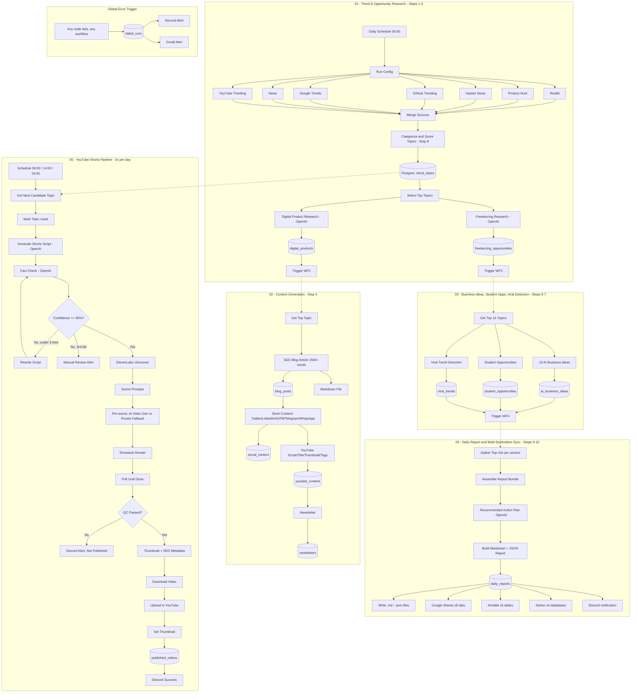

# AI Content Automation — n8n Daily Trend, Product & Content Pipeline

A self-hosted n8n system that implements the full "Master Prompt for n8n AI Content
Automation": it researches trending opportunities every day across 21 categories
(freelancing, digital products, AI tools, SaaS, side hustles, and more), turns the
best ones into a full content package (SEO blog, short-form social posts, YouTube
script, newsletter), generates 10 fresh AI business ideas, finds student-friendly
opportunities, detects viral trends, scores everything on 8 dimensions, and produces
a daily report that's synced to Postgres, Google Sheets, Airtable, Notion, and
Markdown/JSON files. A fifth workflow turns the same daily trend pool into **3
AI-generated YouTube Shorts published to your channel every day**, complete with
fact-checking, voiceover, AI video generation (with stock-footage fallback), thumbnail,
SEO metadata, and automated QC before publish.

Import order: `workflows/error-handler-workflow.json` →
`workflows/01-trend-research-workflow.json` → `workflows/02-content-generation-workflow.json`
→ `workflows/03-business-student-viral-workflow.json` → `workflows/04-daily-report-workflow.json`
→ `workflows/05-youtube-shorts-pipeline.json`.
Set every workflow's `settings.errorWorkflow` to the imported Error Handler's real
workflow ID after import (the placeholder `error-workflow-id` in each JSON file must
be replaced).

---

## 1. Architecture Diagram



---

## 2. Node-by-Node Explanation

### Workflow 01 — Trend & Opportunity Research (Steps 1–3)

| Node | Purpose |
|---|---|
| **Daily Schedule Trigger (06:00)** | Cron `0 6 * * *` — one full research + content run per day |
| **Run Config** | Generates `run_id`/`run_date` used to tie every downstream row together |
| **Fetch Reddit / Product Hunt / Hacker News / GitHub Trending / Google Trends / News / YouTube Trending** | 7 parallel HTTP calls, each with `continueOnFail` + retry so one dead source doesn't kill the run |
| **Merge All Sources** | Appends all 7 branches into one flat item list |
| **Categorize & Score Topics** | Code node: maps each raw item into one of the 21 opportunity categories via keyword heuristics, tags a recency window (24h/7d/30d), dedupes, and computes all 8 STEP-8 scores (demand, profitability, difficulty, competition, SEO, viral, automation, long-term) |
| **Save Trend Topics (Postgres)** | Persists the full scored candidate pool |
| **Select Top Topics** | Keeps the top 2 topics per category (≤20 total) as research seeds |
| **Digital Product Research (OpenAI)** | STEP 2 — returns ≥10 digital products with all required fields + scores |
| **Freelancing Research (OpenAI)** | STEP 3 — returns ≥10 freelancing opportunities with all required fields + scores |
| **Parse + Save nodes** | Validate/flatten each AI response, insert one row per idea |
| **Trigger Content Generation / Trigger Business-Student-Viral** | `Execute Workflow` nodes hand off to workflows 02 and 03 |

### Workflow 02 — Content Generation (Step 4)

| Node | Purpose |
|---|---|
| **Get Top Topic (Postgres)** | Pulls the single highest-scoring candidate topic |
| **Generate SEO Blog Article** | Enforces JSON schema: title, meta description, SEO keywords, intro, main content (markdown, H2/H3), conclusion, ≥5 FAQs; system prompt requires ≥1500 words total |
| **Parse & Validate Blog** | Computes actual word count and carries it forward for auditing |
| **Build Blog Markdown / Write Blog Markdown File** | Renders the blog as a `.md` file under `output/blogs/` |
| **Generate Short Content** | One call returning Twitter thread, LinkedIn post, Instagram caption, Facebook post, Telegram post, WhatsApp broadcast |
| **Generate YouTube Content** | Video title, thumbnail idea, full script, description, tags, hashtags |
| **Generate Newsletter** | Weekly trends, market insights, opportunities, actionable tips, recommended tools, business ideas |
| Each generator has a matching **Parse** + **Save (Postgres)** pair | One table per content type (`blog_posts`, `social_content`, `youtube_content`, `newsletters`) |

### Workflow 03 — AI Business Ideas, Student Opportunities & Viral Detection (Steps 5–7)

| Node | Purpose |
|---|---|
| **Get Top 15 Topics** | Broader context window than WF2's single topic, since these calls need category diversity |
| **Generate 10 AI Business Ideas** | STEP 5 — problem, solution, target users, revenue model, dev cost, market size, monthly revenue potential, MVP features, AI features, monetization strategy + 4 scores |
| **Parse & Validate 10 Ideas** | Throws (→ Error Handler) if the model returns fewer than 10 ideas |
| **Generate Student Opportunities** | STEP 6 — online earning, internships, digital products, AI tools, freelancing, remote jobs, each with skill level/income/time/platforms/resources |
| **Detect Viral Trends** | STEP 7 — virality score, growth potential, competition score, revenue potential, plus the full STEP 8 scoring set |
| **Merge Completion → Trigger Daily Report & Sync** | Waits for all three branches, then hands off to workflow 04 |

### Workflow 04 — Daily Report & Multi-Destination Sync (Steps 9–10)

| Node | Purpose |
|---|---|
| **13 parallel Postgres SELECTs** | Top 10 opportunities/products/freelancing niches/AI tools/startup ideas/trending topics/side hustles, highest-revenue idea, lowest-competition opportunity, and the latest blog/social/YouTube/newsletter rows |
| **Merge All Report Data → Assemble Report Bundle** | Regroups the 13 branches back into named fields (Merge flattens; the Code node re-attributes by source node name) |
| **Generate Recommended Action Plan (OpenAI)** | STEP 9 §10 — today/this-week/this-month guidance based on the highest-demand + lowest-competition + highest-revenue items |
| **Build Daily Report** | Renders the full 10-section Markdown report and keeps the structured JSON alongside it |
| **Save Daily Report (Postgres)** | System of record for the report |
| **Write Markdown / JSON files** | STEP 10 file outputs |
| **Sync to Google Sheets (×8 tabs)** | Trends, Digital Products, Freelancing, AI Business Ideas, Blogs, Social Media Posts, Newsletters, Daily Reports — one tab per output category |
| **Sync to Airtable (×5 tables)** | Trends, Digital Products, Freelancing, AI Business Ideas, Daily Reports |
| **Sync to Notion (×4 databases)** | Trends, Products, Content, Reports databases (configure the 4 database IDs in `.env`) |
| **Notify Report Ready (Discord)** | Posts the day's headline numbers |

### Workflow 05 — YouTube Shorts Pipeline (3×/day)

| Node | Purpose |
|---|---|
| **Shorts Schedule Trigger (3x/day)** | Cron `0 9,14,19 * * *` — 3 firings/day, each publishing 1 Short |
| **Get Next Candidate Topic** | Pulls the single highest-scoring `trend_topics` row still marked `candidate` — same pool workflow 01 fills at 06:00, so the 3 daily firings each consume a different topic |
| **Mark Topic Used** | Flips that row to `status='used'` immediately, so the next firing (and workflow 02/03/04) don't reuse it |
| **Generate Shorts Script (OpenAI)** | 30–55s script (110–150 words): title, hook, curiosity gap, explanation, CTA to "link in bio", keywords, hashtags |
| **Fact Check → Confidence >= 90%?** | Independent OpenAI verification pass; below threshold routes to **Rewrite Script**, looped back into fact-check, capped at 3 attempts by `_rewrite_count`, then to a Discord "needs manual review" alert instead of an infinite loop |
| **Generate Voiceover (ElevenLabs)** | TTS → MP3 binary |
| **Generate Scene Prompts / Split Into Scenes** | Splits the script into sentences, builds one cinematic 9:16 prompt per sentence, loops each through video generation |
| **AI Video Gen (Runway/Kling/Veo)** | Per-scene AI video clip; `continueOnFail` + **Fallback: Stock Footage (Pexels)** on failure/timeout, both normalized to the same shape before merging |
| **Build Shotstack Timeline → Render → Poll → Automated Quality Check** | Assembles captions/transitions/zoom/audio, renders, polls until done, then checks duration (20–60s) |
| **QC Passed?** | Failing QC alerts Discord and stops — never uploads a broken render |
| **Generate Thumbnail (Bannerbear) + Generate SEO Metadata (OpenAI)** | Run in parallel, merged before upload |
| **Download Rendered Video / Download Thumbnail Image** | Pulls the actual MP4/PNG bytes into binary (`data`/`thumbnail`) — Shotstack and Bannerbear return URLs, not files, so these HTTP nodes are required before the YouTube node can attach them |
| **Upload to YouTube** | Uploads `private` with `publishAt` ~1h out (manual spot-check buffer before going public) |
| **Set YouTube Thumbnail → Log Published Video (Postgres) → Notify Success (Discord)** | Attaches thumbnail, logs to `published_videos`, posts the live link |

**Error handler workflow** (wired as the global `errorWorkflow` for all five
pipelines): catches any node failure anywhere in the system, logs it to
`failed_runs`, and alerts both Discord and Gmail with the failed workflow/node/message.

---

## 3. Required APIs & Free Alternatives

| Function | Paid option | Free/self-hosted alternative |
|---|---|---|
| Reddit trends | Reddit API (free with OAuth app) | No paid tier needed |
| Product Hunt trends | Product Hunt GraphQL API (free developer token) | No paid tier needed |
| Hacker News trends | — | Algolia HN Search API is free, no key required |
| GitHub trending | GitHub REST API (free, higher rate limit with a token) | Unauthenticated calls work at a lower rate limit |
| Google Trends | SerpAPI (~$50/mo) | `pytrends` unofficial library on a small Python microservice, called via HTTP Request node |
| News | NewsAPI.org (free tier: 100 req/day) | GNews free tier, or RSS-to-JSON on Google News RSS |
| YouTube trending | YouTube Data API v3 | Free — just quota-limited (10k units/day) |
| Research + content generation | OpenAI GPT-4.1 | Local Llama 3.1 / Mistral via Ollama (lower quality, zero marginal cost) |
| Database | Postgres/Supabase (this repo's default, free self-hosted or Supabase free tier) | — |
| Secondary storage | Airtable (free tier: 1,000 records/base), Google Sheets (free), Notion (free) | All have generous free tiers already |
| Alerts | Discord webhook (free), Gmail (free) | No paid alternative needed |
| Voiceover | ElevenLabs (~$5–22/mo) | Piper/Coqui TTS self-hosted (free); Google Cloud TTS free tier (1M chars/mo) |
| AI video generation | Runway/Kling/Veo API (usage-based, ~$0.05–0.50/sec) | Skip AI video and use Pexels/Pixabay stock footage as the *primary* source instead of fallback — near-free |
| Video editing/render | Shotstack (~$0.40–1/render) | Self-hosted FFmpeg + Remotion (free, more setup) |
| Thumbnail | Bannerbear (~$49/mo) | OpenAI image generation + a Code node compositing text via `node-canvas` |
| YouTube upload/metadata | YouTube Data API v3 | Free — quota-limited (10k units/day; an upload costs ~1,600 units, so ~6 uploads/day max per project before requesting a quota increase) |

---

## 4. Credentials to Configure in n8n

Create these under **Settings → Credentials**:

1. `OpenAI account` — API key
2. `Reddit OAuth2` — client ID/secret, script-type app
3. `Postgres account` — host/user/password (matches `docker/.env`)
4. `Google Sheets account` (OAuth2)
5. `Airtable account` (Personal Access Token)
6. `Notion account` (internal integration token, shared with the 4 target databases)
7. `Discord Webhook` — per-workflow webhook URL
8. `Gmail account` (OAuth2) — for failure emails
9. `YouTube OAuth2` — Google Cloud OAuth client with `youtube.upload`, `youtube.readonly`
   scopes, consented by the channel's owning Google account (walkthrough: section 9)

HTTP Request nodes calling Product Hunt, Hacker News, GitHub, SerpAPI, NewsAPI,
ElevenLabs, Runway/Kling/Veo, Pexels, Shotstack, and Bannerbear use header/query auth
pulled from environment variables (see `docker/.env.example`) rather than n8n
credential objects, since these are simple API-key/token services — convert any of
them to a **Generic Header Auth** credential if you prefer not to store keys in `.env`.

---

## 5. Environment Variables

See `docker/.env.example` for the full list, grouped by pipeline stage. Copy it to
`.env` and fill in real values before starting the stack:

```bash
cp docker/.env.example docker/.env
```

---

## 6. Folder Structure

```
.
├── workflows/
│   ├── error-handler-workflow.json              # global error catcher (import first)
│   ├── 01-trend-research-workflow.json           # Steps 1-3
│   ├── 02-content-generation-workflow.json       # Step 4
│   ├── 03-business-student-viral-workflow.json   # Steps 5-7
│   ├── 04-daily-report-workflow.json             # Steps 9-10
│   └── 05-youtube-shorts-pipeline.json           # 3 Shorts/day, sourced from Step 1's trend pool
├── db/
│   └── schema.sql                                 # Postgres/Supabase schema
├── docker/
│   ├── docker-compose.yml
│   └── .env.example
└── README.md                                      # this file
```

---

## 7. Error Handling & Retry Logic

- **Per-node retries**: every external API call (`httpRequest`, `openAi`, `postgres`)
  has `retryOnFail: true` with 2–3 attempts and backoff (2–5s).
- **continueOnFail** on trend-source HTTP calls and secondary-storage sync nodes
  (Sheets/Airtable/Notion) means one dead API degrades that one destination instead
  of halting the run — Postgres remains the system of record regardless.
- **Idea-count guard**: `Parse & Validate 10 Ideas` throws if the model returns fewer
  than 10 AI business ideas, routing the run to the Error Handler instead of silently
  under-delivering STEP 5's daily quota.
- **Blog word-count tracking**: `Parse & Validate Blog` computes the real word count
  so short outputs are visible in Postgres/reports even though they aren't hard-blocked
  (tighten this into an IF-gated regenerate loop if you need a hard 1500-word floor).
- **Global Error Trigger**: every workflow's `settings.errorWorkflow` points at
  `error-handler-workflow.json`, which logs to `failed_runs` and pages Discord + Gmail
  for anything not already caught locally.
- **Shorts fact-check loop**: capped at 3 rewrite attempts (`_rewrite_count`), then
  routes to a Discord "needs manual review" alert instead of publishing an
  unverified script or looping forever.
- **Shorts render polling**: `Poll Render Status` loops on `Wait for Render` until
  Shotstack reports `done`, with a max-tries cap (15 × 15s) to prevent infinite polling.
- **Shorts QC gate**: failed quality checks (duration out of the 20–60s Shorts range)
  never reach the YouTube upload step — they route to a Discord alert instead.

---

## 8. Deployment Guide (Self-Hosted, Docker)

1. **Provision a VM** (2 vCPU / 4GB RAM minimum).
2. **Install Docker & Docker Compose.**
3. Clone/copy this project folder to the server.
4. `cd docker && cp .env.example .env` and fill in all credentials/keys.
5. `docker compose up -d` — starts Postgres + n8n.
6. Open `http://<server-ip>:5678`, log in with your basic-auth credentials.
7. **Import workflows** in this order: Error Handler → 01 Trend Research → 02 Content
   Generation → 03 Business/Student/Viral → 04 Daily Report → 05 YouTube Shorts
   (`Workflows → Import from File`, pick each JSON from `workflows/`).
8. Set every workflow's error workflow to the imported Error Handler
   (`Workflow Settings → Error Workflow`) — this replaces the placeholder
   `error-handler-workflow-id` string baked into each JSON file.
9. Update the three `Execute Workflow` nodes (in WF01 → WF02/WF03, and WF03 → WF04)
   to point at the actual imported workflow IDs — n8n reassigns IDs on import.
   Workflow 05 doesn't need this: it reads directly from `trend_topics` on its own
   schedule rather than being triggered by another workflow.
10. Configure the 9 credential types listed in section 4 (including `YouTube OAuth2`
    — see section 9 if you haven't set this up before), and the 4 Notion database
    IDs / Google Sheet ID / Airtable base ID / `YT_CHANNEL_ID` in `.env`.
11. Run workflow 01 once manually to verify each branch before activating the
    schedule trigger; then run workflow 05 once manually against a leftover
    `candidate` topic to verify the full render → upload chain before activating
    its schedule.
12. Put a reverse proxy (Caddy/Nginx) with TLS in front of port 5678 for anything
    beyond local testing — see security notes below.

---

## 9. YouTube OAuth2 Setup (Google Cloud Console)

Workflow 05 uploads real videos to your channel, which requires a Google Cloud
OAuth client — there's no API-key shortcut for this. Walkthrough:

1. **Create/select a Google Cloud project**: [console.cloud.google.com](https://console.cloud.google.com) →
   create a new project (or reuse one) dedicated to this automation.
2. **Enable the YouTube Data API v3**: in the project, go to
   *APIs & Services → Library*, search "YouTube Data API v3", click **Enable**.
3. **Configure the OAuth consent screen**: *APIs & Services → OAuth consent screen*.
   - User type: **External** (unless you have a Google Workspace org, then Internal
     is simpler).
   - Fill in app name, support email, developer contact.
   - Scopes: add `.../auth/youtube.upload` and `.../auth/youtube.readonly`.
   - Test users: add the Google account that owns the target YouTube channel (while
     the app is in "Testing" mode, only listed test users can authorize it).
4. **Create OAuth client credentials**: *APIs & Services → Credentials → Create
   Credentials → OAuth client ID*.
   - Application type: **Web application**.
   - Authorized redirect URI: `https://<your-n8n-host>/rest/oauth2-credential/callback`
     (n8n shows you this exact URL when you create the credential in the next step —
     copy it from there to avoid typos).
   - Save the generated **Client ID** and **Client Secret**.
5. **Create the credential in n8n**: *Settings → Credentials → New → YouTube OAuth2
   API*. Paste the Client ID/Secret, click **Connect my account**, and sign in with
   the Google account that owns the channel — approve the consent screen.
6. **Publishing status**: while the OAuth consent screen is in "Testing" mode, tokens
   expire every 7 days and only test users can connect. For a long-running unattended
   pipeline, submit the app for **verification** (Google reviews the requested
   scopes) so tokens don't expire — required if `youtube.upload` is requested and you
   want this to run for months without re-authenticating.
7. **Find your channel ID** for `YT_CHANNEL_ID` in `.env`: YouTube Studio →
   Settings → Channel → Advanced settings, or `https://www.youtube.com/account_advanced`.

---

## 10. API Cost Estimation (per daily run, rough)

| Stage | Cost |
|---|---|
| Trend APIs (SerpAPI/NewsAPI, amortized) | ~$0.02–0.08 |
| Digital product + freelancing research (2 GPT-4.1 calls) | ~$0.03–0.08 |
| Blog + social + YouTube + newsletter (4 GPT-4.1 calls, one ~1500-word) | ~$0.08–0.20 |
| 10 AI business ideas + student opportunities + viral detection (3 GPT-4.1 calls) | ~$0.05–0.12 |
| Recommended action plan (1 short GPT-4.1 call) | ~$0.01 |
| **Total per day** | **~$0.20–0.50** |

At 1 run/day this is roughly **$6–15/month** in OpenAI spend, plus free-tier usage
of every other API in section 3. Swap `OPENAI_MODEL`/`OPENAI_RESEARCH_MODEL` to a
smaller model or a local Ollama model to push this toward zero.

### Per-video cost (workflow 05, AI video generation mode)

| Stage | Cost |
|---|---|
| Script + fact-check + SEO metadata (up to 4 GPT-4.1 calls incl. one possible rewrite) | ~$0.02–0.06 |
| ElevenLabs voiceover (~130 words) | ~$0.02–0.05 |
| AI video gen (5–8 scenes × ~5s clips, Runway/Kling/Veo) | ~$1.50–4.00 — **this dominates the cost** |
| Shotstack render | ~$0.40–1.00 |
| Bannerbear thumbnail | ~$0.05 |
| **Total per video** | **~$2–5.20** |

At 3 videos/day that's roughly **$180–470/month**. Since you chose full AI video
generation over stock footage, this is the real number to budget for — see section
12 for how to cut it by switching individual topics to the stock-footage fallback
path once they're proven low-value, without touching the workflow's structure.

---

## 11. Security Best Practices

- Never commit `.env` — it holds every API key. Add it to `.gitignore`.
- Use n8n's built-in credential store (encrypted at rest via `N8N_ENCRYPTION_KEY`)
  instead of raw env vars wherever a credential type exists (OpenAI, Postgres,
  Google Sheets, Airtable, Notion, Gmail) — reserve `.env` for simple API-key
  services (Product Hunt, GitHub, SerpAPI, NewsAPI).
- Put n8n behind a reverse proxy with TLS and keep `N8N_BASIC_AUTH_ACTIVE=true`, or
  better, put it behind SSO/VPN if self-hosting long-term.
- Scope every OAuth credential (Google Sheets, Gmail, **YouTube**) to only the
  required scopes (`youtube.upload` + `youtube.readonly` — never request
  `youtube.force-ssl` or channel-management scopes this pipeline doesn't use);
  rotate refresh tokens if the server is ever exposed.
- Store the Postgres volume on encrypted disk if hosting on a cloud VM.
- Rotate all API keys periodically and immediately on suspected leak (e.g., a key
  pasted into a public workflow export).
- Uploads default to `privacyStatus: private` with a 1-hour `publishAt` buffer —
  don't change this to `public` immediate-publish until you've watched at least a
  few days of unattended runs; a bad script or fact-check false-pass otherwise goes
  straight to your live channel.

---

## 12. Optimization Suggestions

- **Cache trend results** for a few hours (Code node + a small KV table) if you ever
  move to multiple runs/day, to avoid redundant API calls.
- **Feed `daily_reports` back into `Categorize & Score Topics`** as a bias multiplier
  for categories/sources that historically scored well, closing the feedback loop
  STEP 11-style optimization implies.
- **Cap and monitor the idea-count guard** in workflow 03 — route repeated failures
  to a manual-review path instead of just erroring indefinitely.
- **Split `04-daily-report-workflow`'s Google Sheets/Airtable/Notion fan-out** behind
  a config flag per destination if you don't use all three simultaneously — every
  sync node is already wired with `continueOnFail`, so disabling unused credentials
  is safe without editing connections.
- **Prefer a single richer OpenAI call over many small ones** where the schema allows
  it (already done for short-form social content and for freelancing/product
  research) to reduce latency and per-call overhead.

---

## 13. Destination Schema Reference (create these before running workflow 04)

The Sheets/Airtable sync nodes use `autoMapInputData`, which writes whatever fields
are on the incoming item — it does **not** create the tab/table/columns for you.
Create each of these with matching headers/fields *before* the first run, or the
sync nodes will fail (harmlessly, since they're all `continueOnFail` — but nothing
will land there).

| Destination | Source table | Columns to create |
|---|---|---|
| Sheets tab `TrendTopics` / Airtable `TrendTopics` / Notion Trends DB | `trend_topics` | id, run_id, title, category, source, window, demand_score, profitability_score, difficulty_score, competition_score, seo_score, viral_score, automation_score, longterm_score, overall_score, status, created_at |
| Sheets tab `DigitalProducts` / Airtable `DigitalProducts` / Notion Products DB | `digital_products` | id, run_id, product_name, product_type, description, target_audience, difficulty_level, estimated_price_usd, market_demand, competition_level, monthly_income_low_usd, monthly_income_high_usd, best_platform, marketing_strategy, demand_score, profitability_score, difficulty_score, competition_score, created_at |
| Sheets tab `Freelancing` / Airtable `Freelancing` | `freelancing_opportunities` | id, run_id, skill_required, niche_type, income_potential, best_platform, demand_level, learning_resources, portfolio_ideas, how_to_get_clients, average_pricing, demand_score, profitability_score, competition_score, created_at |
| Sheets tab `AIBusinessIdeas` / Airtable `AIBusinessIdeas` | `ai_business_ideas` (top-10 by profitability) | id, run_id, idea_name, problem, solution, target_users, revenue_model, estimated_dev_cost_usd, market_size, monthly_revenue_potential_usd, mvp_features, ai_features, monetization_strategy, demand_score, profitability_score, difficulty_score, automation_score, created_at |
| Sheets tab `Blogs` | `blog_posts` (latest row) | id, run_id, topic_id, title, meta_description, seo_keywords, introduction, main_content, conclusion, faqs, word_count, created_at |
| Sheets tab `SocialMediaPosts` | `social_content` (latest row) | id, run_id, blog_post_id, twitter_thread, linkedin_post, instagram_caption, facebook_post, telegram_post, whatsapp_broadcast, created_at |
| Sheets tab `Newsletters` | `newsletters` (latest row) | id, run_id, weekly_trends, market_insights, opportunities, actionable_tips, recommended_tools, business_ideas, created_at |
| Sheets tab `DailyReports` / Airtable `DailyReports` / Notion Reports DB | the assembled report bundle | run_id, report_date, top_opportunities, top_digital_products, top_freelancing_niches, top_ai_tools, top_startup_ideas, top_trending_topics, best_side_hustles, highest_revenue_opportunity, lowest_competition_opportunity, recommended_action_plan, markdown_report — **note**: the array/object columns (`top_opportunities`, `highest_revenue_opportunity`, etc.) land as stringified JSON in a single cell, not flat columns, since this row is the aggregated bundle rather than a per-item row like the other tabs |
| Notion Content DB | latest blog (nested in the report bundle) | Only a Title property is populated (`={{$json.latest_blog.title}}`) — the Notion nodes' `propertiesUi.propertyValues` is intentionally left empty in the JSON since I don't know your database's actual property names/types; add properties matching the `Blogs` row above and populate `propertiesUi.propertyValues` in n8n's UI once the database exists if you want full parity instead of a title-only page |

For Airtable and Notion specifically, column/property **types** matter (number vs.
text vs. multi-select) — `*_score` and `*_usd` fields should be Number, `keywords`/
`tags`/`hashtags`/`mvp_features`/`ai_features` arrays should be Multiple Select or
Long Text (Airtable's API will reject a plain array against a Single Line Text
field), and `faqs` (an array of `{question, answer}` objects) should be Long Text —
Airtable/Notion have no native nested-object field type.
- **Bias workflow 05 toward stock footage for lower-scored topics**: change the
  `AI Video Gen (Runway/Kling/Veo)` node to `continueOnFail`-skip straight to Pexels
  when `overall_score` is below a threshold, reserving the ~$2–5/video AI generation
  spend for only your highest-scoring daily topic — this alone can cut the section-10
  monthly estimate by roughly two-thirds without any structural workflow change.
- **Watch YouTube Data API quota**: each upload costs ~1,600 units against the
  10,000/day free quota; at 3 uploads/day plus the analytics/metadata calls this
  workflow makes, you have headroom, but request a quota increase in Google Cloud
  Console before adding more channels or more daily uploads.
